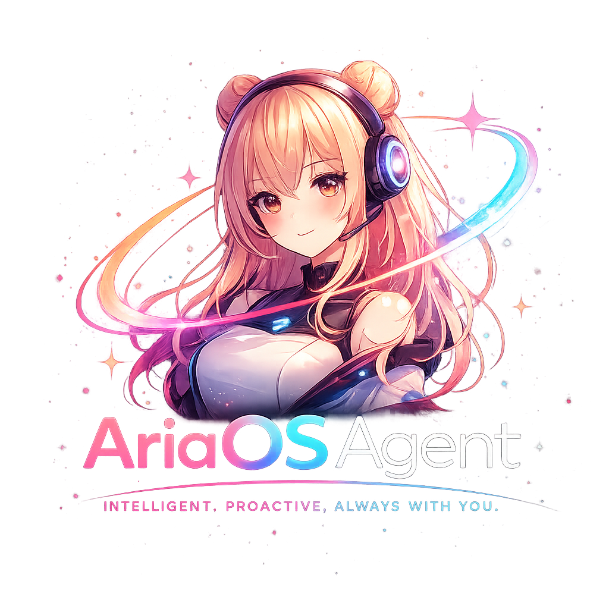

<p align="center">
  
</p>

<p align="center">
  <a href="https://ariaos.me"><strong>Website</strong></a> &middot;
  <a href="https://github.com/makekush7-netizen/AriaOSAgent"><strong>GitHub</strong></a> &middot;
  <a href="#-quickstart"><strong>Quickstart</strong></a> &middot;
  <a href="#-features"><strong>Features</strong></a> &middot;
  <a href="#-architecture"><strong>Architecture</strong></a> &middot;
  <a href="#-api"><strong>API</strong></a> &middot;
  <a href="#-roadmap"><strong>Roadmap</strong></a>
</p>

<p align="center">
  <a href="https://github.com/makekush7-netizen/AriaOSAgent/blob/main/LICENSE"></a>
  <a href="https://github.com/makekush7-netizen/AriaOSAgent"></a>
  <a href="https://ariaos.me"></a>
  <a href="https://github.com/makekush7-netizen/AriaOSAgent"></a>
  <a href="#"></a>
</p>

# ARIA — Your Personal AI Proxy That Lives on Your Desktop (Open-Source Alternative to UiPath, Rabbit R1, Claude Computer Use)

**[Website](https://ariaos.me)** · **[Live Demo](https://aria-os-website.vercel.app)** · **[GitHub](https://github.com/makekush7-netizen/AriaOSAgent)**

ARIA (Agentic RPA Interface Assistant) is a downloadable desktop application with a 3D animated VRM companion that understands natural language commands and autonomously executes complex multi-step computer tasks — browsing websites, filling forms, sending bulk emails, generating certificates, and conducting deep research — using your own accounts and identity.

> [!TIP]
> **Star us on GitHub!** A ⭐ shows your support and encourages us to keep building! 😇

### ✨ Why ARIA

No SaaS lock-in · No cloud dependency · Full control over your data and accounts

What makes ARIA different?

- **3D VRM Companion** — A persistent, animated character that reacts to events, speaks with voice, and provides emotional feedback
- **Browser Agent** — Opens real websites in Chromium, fills forms, navigates multi-page flows using DOM overlay + Vision AI
- **Persistent Memory** — Never fills in the same field twice. Remembers your name, email, college, and task patterns across sessions
- **Local Privacy** — Personal memory, Aadhaar numbers, banking info never leave your device. Sensitive tasks run on local models
- **Sub-Agent Architecture** — ARIA delegates heavy tasks to named child agents while staying available for conversation
- **Voice Control** — Wake word activation + voice input + high-quality TTS output via Cartesia / AWS Nova Sonic
- **Skill Marketplace** — Extend ARIA with new capabilities without reinstalling the app
- **Fully Open-Source** — Apache 2.0 licensed, inspect, modify, and contribute
- **Tauri Desktop App** — Native app for Windows, macOS & Linux. One installer, working agent in under 5 minutes

#

### 🎛 Features

<p align="center">
  
</p>

#

### 🖥 ARIA Desktop

Create a personal AI proxy that runs entirely on your machine. ARIA uses your accounts, operates your browser, and keeps all your data local.

**Available Platforms**

<table>
<tr>
<th align="left">Platform</th>
<th align="left">Architecture</th>
<th align="left">Package</th>
<th align="left">Status</th>
</tr>

<tr>
<td><b>Windows</b></td>
<td>x64</td>
<td><code>.msi</code> / <code>.exe</code></td>
<td><a href="#">Available ↗</a></td>
</tr>

<tr>
<td><b>macOS</b></td>
<td>Apple Silicon / Intel</td>
<td><code>.dmg</code></td>
<td><a href="#">Coming Soon ↗</a></td>
</tr>

<tr>
<td><b>Linux</b></td>
<td>x64</td>
<td><code>.deb</code> / <code>.AppImage</code></td>
<td><a href="#">Coming Soon ↗</a></td>
</tr>

</table>

#

ARIA gives you complete control over your AI agent workflow. Choose your models, customize your experience, and keep your data private.

- **Browser Agent** — Opens ANY website in a real Chromium browser. DOM overlay badges tag interactive elements. Vision fallback for complex SPAs
- **Form Auto-Fill** — Fills any web form using your profile memory without asking for known fields. Multi-page registration flows handled end-to-end
- **Human-in-the-Loop (HITL)** — ARIA pauses and asks for approval before sensitive actions. Batch input modals for unknown fields
- **Persistent Memory System** — Three layers: Working Memory (session), Episodic Memory (ChromaDB vectors), Semantic Profile (JSON). You never repeat yourself
- **Sub-Agent Orchestrator** — Named child agents (BrowserBot, ScriptRunner, ResearchBot) execute tasks autonomously with live heartbeat chips
- **Research Agent** — Multi-step autonomous research pipeline with Tavily search, content extraction, and structured output with citations
- **Certificate Generator** — Template image + CSV → batch of named PDFs with live preview
- **Bulk Email** — CSV-driven email campaigns with template variables and rate-limit controls
- **Python Sandbox** — Sandboxed script execution for data transformation, file operations, and API calls
- **Voice Control** — Porcupine wake word detection (runs locally at ~2% CPU), Web Speech API input, Cartesia / AWS Nova Sonic TTS
- **Task Canvas System** — Morphing UI panels for forms, certificates, research, email blasts, and scripts
- **Skill Marketplace** — Browse, install, and activate skill plugins. Hot-reload without app restart
- **3D VRM Companion** — Animated character with emotion states, lip sync, and personality. Built with Three.js + @pixiv/three-vrm
- **Multi-LLM Support** — AWS Bedrock (Nova Pro/Lite), Google Gemini, or local Ollama models. Auto-fallback between providers
- **Fully Open-Source** — Apache 2.0 licensed, inspect, modify, and contribute
- **Tauri Native** — Lightweight desktop app with Rust backend. True OS-level window access

#

### ⚡ Quickstart

You can run ARIA in two ways: **Desktop App (Tauri)** for the full native experience, or **Backend + Browser** for development.

**Option 1: Desktop App (Recommended)**

Run ARIA as a native desktop application with the 3D companion, voice control, and full UI.

<p>
  <strong>Prerequisites:</strong> Node.js (v16+), Rust, Python 3.10+, Git
</p>

- Clone & Setup (First Time)

  <pre><code class="language-bash">git clone https://github.com/makekush7-netizen/AriaOSAgent.git
  cd AriaOSAgent</code></pre>

- Install Backend Dependencies

  <pre><code class="language-bash">cd backend
  pip install -r requirements.txt</code></pre>

- Configure Environment

  <pre><code class="language-bash">cp .env.example .env
  # Edit .env with your API keys</code></pre>

- Install Frontend Dependencies

  <pre><code class="language-bash">cd ../frontend
  npm install</code></pre>

- Run in Development

  <pre><code class="language-bash">npm run tauri dev</code></pre>

  <p>
  This starts the Vite dev server and launches the Tauri desktop window with the full ARIA experience.
  </p>

- Build Distributable (Optional)

  To create installers for Windows, macOS, or Linux:

  <pre><code class="language-bash">cd ../src-tauri
  cargo tauri build</code></pre>

  <p>
  Output files are written to <code>src-tauri/target/release/bundle</code>.
  </p>

**Option 2: Backend + Browser (Development)**

Run only the FastAPI backend and connect via browser for quick iteration.

- Start Backend

  <pre><code class="language-bash">cd backend
  python run.py</code></pre>

- Open in Browser

  <p>
  Open <a href="http://localhost:8000">http://localhost:8000</a> in the browser of your choice.
  </p>

  <blockquote>
  <p>
    <strong>Note:</strong> The backend runs on port <code>8000</code> by default. The full 3D companion and desktop features require the Tauri app.
  </p>
  </blockquote>

#

### ⚙️ Configuration

ARIA is configured via environment variables in <code>backend/.env</code>. Copy <code>.env.example</code> to get started.

#### LLM Provider

- **LLM_PROVIDER**=[gemini/bedrock/auto]: Select the text LLM provider. <code>auto</code> tries Bedrock first, falls back to Gemini
- **GEMINI_API_KEY**: Required if using Gemini
- **GEMINI_MODEL**: Gemini text model (default: <code>gemini-1.5-flash</code>)
- **GEMINI_VISION_MODEL**: Gemini vision model for browser agent (default: <code>gemini-1.5-flash</code>)
- **AWS_ACCESS_KEY_ID**: Required if using Bedrock
- **AWS_SECRET_ACCESS_KEY**: Required if using Bedrock
- **AWS_REGION**: AWS region for Bedrock (default: <code>us-east-1</code>)

#### Voice & TTS

- **CARTESIA_API_KEY**: Required for Cartesia TTS voice output
- AWS Nova Sonic is used for high-quality TTS when Bedrock is configured
- Wake word detection runs locally via Porcupine (no API key needed)

#### Memory System

| Component | Description | Storage |
|---|---|---|
| **Working Memory** | Last 15 messages in active session | In-memory |
| **Episodic Memory** | Compressed task summaries with vector search | Local ChromaDB |
| **Semantic Profile** | User identity (name, email, college, patterns) | <code>backend/memory.json</code> |

- Memory is fully local — no data leaves your device
- ChromaDB uses <code>sentence-transformers</code> for embeddings (<code>BAAI/bge-small-en-v1.5</code>)
- On every new message, the top 3-5 relevant episodes are retrieved semantically and injected as context

#### Browser Agent

- **Mode:** DOM overlay (primary) + Vision fallback (automatic)
- **Browser Profile:** Stored in <code>backend/browser_profile/</code> — persistent Chromium session per site
- **Anti-Detection:** Webdriver flag disabled, Accept-Language header set
- **Max Steps:** 20 steps per <code>browse_and_act</code> invocation
- **Supported Actions:** click, type, scroll, navigate, scrape, key press, ask_user (HITL)

#### Research Agent

- **Search Provider:** Tavily API (primary)
- **Content Extraction:** httpx + BeautifulSoup
- **Output:** Structured Markdown with citations, source URLs, and confidence levels
- **Storage:** Saved to <code>backend/findings/</code> as Markdown files

#### Sub-Agent Types

| Agent | Accent | Purpose |
|---|---|---|
| **BrowserBot** | Blue | All Playwright web navigation tasks |
| **ScriptRunner** | Green | Python script execution in sandbox |
| **ResearchBot** | Purple | Multi-step web research pipeline |

#

### 🔌 API

ARIA exposes a WebSocket-based API for real-time communication between the frontend and backend.

<p>
<strong>Endpoint:</strong> <code>ws://localhost:8000/ws</code><br>
<strong>Protocol:</strong> WebSocket (JSON messages)
</p>

#### Frontend → Backend Messages

<table>
<thead>
<tr>
<th>Message Type</th>
<th>Payload</th>
<th>Description</th>
</tr>
</thead>
<tbody>

<tr>
<td><code>chat_message</code></td>
<td><code>{ content: string, timestamp: string }</code></td>
<td>Send a message to ARIA</td>
</tr>

<tr>
<td><code>permission_response</code></td>
<td><code>{ allowed: boolean, value?: string, values?: object }</code></td>
<td>Respond to HITL permission request</td>
</tr>

<tr>
<td><code>stop_task</code></td>
<td><code>{}</code></td>
<td>Cancel current running task</td>
</tr>

<tr>
<td><code>approve_plan</code></td>
<td><code>{ planId: string, cancelled: boolean }</code></td>
<td>Approve or reject execution plan</td>
</tr>

<tr>
<td><code>cancel_agent</code></td>
<td><code>{ agentId: string }</code></td>
<td>Cancel a running sub-agent</td>
</tr>

</tbody>
</table>

#### Backend → Frontend Messages

<table>
<thead>
<tr>
<th>Message Type</th>
<th>Payload</th>
<th>Description</th>
</tr>
</thead>
<tbody>

<tr>
<td><code>chat_response</code></td>
<td><code>{ content: string }</code></td>
<td>ARIA's text response</td>
</tr>

<tr>
<td><code>agent_thinking</code></td>
<td><code>{}</code></td>
<td>ARIA is processing</td>
</tr>

<tr>
<td><code>task_update</code></td>
<td><code>{ task: string }</code></td>
<td>Progress update for current task</td>
</tr>

<tr>
<td><code>permission_request</code></td>
<td><code>{ title, description, id, inputType?, fields? }</code></td>
<td>HITL modal trigger (confirm, input, or batch)</td>
</tr>

<tr>
<td><code>agent_spawn</code></td>
<td><code>{ agentId, name, accentColor }</code></td>
<td>Sub-agent started — show chip in UI</td>
</tr>

<tr>
<td><code>agent_heartbeat</code></td>
<td><code>{ agentId, status, step }</code></td>
<td>Sub-agent progress update</td>
</tr>

<tr>
<td><code>agent_complete</code></td>
<td><code>{ agentId, result }</code></td>
<td>Sub-agent finished — remove chip</td>
</tr>

<tr>
<td><code>planning_card</code></td>
<td><code>{ plan: { id, summary, steps[] } }</code></td>
<td>Execution plan for user approval</td>
</tr>

<tr>
<td><code>note_created</code></td>
<td><code>{ filename: string }</code></td>
<td>New research/browse result saved</td>
</tr>

</tbody>
</table>

**Example: Send a chat message via WebSocket**

<pre><code class="language-python">import websockets, json

async with websockets.connect("ws://localhost:8000/ws") as ws:
    await ws.send(json.dumps({
        "type": "chat_message",
        "content": "Open IRCTC and book me a train ticket to Delhi",
        "timestamp": "2026-06-14T10:00:00Z"
    }))
    response = await ws.recv()
    print(json.loads(response))</code></pre>

**Example: Trigger browser agent**

<pre><code class="language-json">{
  "type": "chat_message",
  "content": "Go to amazon.in and find me the cheapest laptop under 30000"
}</code></pre>

**Example Response (tool call)**

<pre><code class="language-json">{
  "type": "tool_call",
  "name": "browse_web",
  "args": {
    "url": "https://www.amazon.in",
    "goal": "Search for laptops under 30000 and find the cheapest one"
  }
}</code></pre>

**Example: Planning card shown before execution**

<pre><code class="language-json">{
  "type": "planning_card",
  "plan": {
    "id": "plan_abc123",
    "summary": "Find cheapest laptop on Amazon under ₹30,000",
    "steps": [
      "Navigate to amazon.in",
      "Search for laptops under 30000",
      "Sort by price: low to high",
      "Extract top 3 results with prices"
    ]
  }
}</code></pre>

#

### 🏗 Architecture

<table>
<tr>
<th>Layer</th>
<th>Technology</th>
<th>Purpose</th>
</tr>
<tr>
<td><b>Desktop Shell</b></td>
<td>Tauri 2.x (Rust)</td>
<td>Native window management, OTA updates, system tray, auto-updater</td>
</tr>
<tr>
<td><b>Frontend UI</b></td>
<td>React 18 + Vite + Zustand</td>
<td>Chat panel, Task Canvas, Memory panel, Settings, Store</td>
</tr>
<tr>
<td><b>3D Companion</b></td>
<td>Three.js + @pixiv/three-vrm</td>
<td>VRM character with emotion states, lip sync, Mixamo animations</td>
</tr>
<tr>
<td><b>Backend API</b></td>
<td>Python FastAPI + WebSocket</td>
<td>LLM routing, agent orchestration, memory CRUD, TTS</td>
</tr>
<tr>
<td><b>Browser Engine</b></td>
<td>Playwright (Chromium)</td>
<td>DOM overlay, vision screenshots, form filling, web navigation</td>
</tr>
<tr>
<td><b>Memory</b></td>
<td>ChromaDB + sentence-transformers</td>
<td>Episodic memory with semantic retrieval, user profile JSON</td>
</tr>
<tr>
<td><b>LLM Providers</b></td>
<td>AWS Bedrock (Nova) · Gemini · Ollama</td>
<td>Reasoning, vision, intent classification with auto-fallback</td>
</tr>
<tr>
<td><b>Voice</b></td>
<td>Porcupine + Web Speech API + Cartesia</td>
<td>Wake word, speech-to-text, text-to-speech</td>
</tr>
<tr>
<td><b>Search</b></td>
<td>Tavily + httpx + BeautifulSoup</td>
<td>Research agent web search and content extraction</td>
</tr>
</table>

**How the Browser Agent Works:**

1. User issues a command: *"Fill out this hackathon registration form"*
2. ARIA parses intent, builds an execution plan, shows Planning Card for approval
3. User approves → BrowserBot sub-agent spawns (chip appears with heartbeat)
4. Chromium opens the target URL
5. **DOM Mode:** JavaScript overlay tags every interactive element with numbered badges `[1]`, `[2]`, etc.
6. LLM reads labeled DOM and outputs action sequence referencing badge IDs
7. If confidence is low → automatic fallback to **Vision Mode** (screenshot → Gemini Vision → coordinates)
8. HITL modal fires for unknown fields → user provides input → automation resumes
9. On completion → summary delivered, sub-agent chip despawns, memory updated

**Memory Retrieval Flow:**

1. User sends a message
2. Query is embedded via sentence-transformers
3. ChromaDB returns top 3-5 relevant episodic memories
4. These are injected as context alongside the semantic profile (name, email, preferences)
5. LLM generates response with full personal context
6. After task completion → new episode is compressed and stored

#

### 🛡 Safety & Privacy

- **Human-in-the-Loop** — ARIA never executes sensitive actions without explicit user approval
- **Local-First Memory** — Personal data (Aadhaar, banking, passwords) never leaves your device
- **Sandboxed Execution** — Python scripts run in restricted subprocess with no network access unless granted
- **Persistent Browser Profiles** — You log into websites yourself. ARIA never stores or reads passwords
- **Transparent Actions** — Every browser action is narrated in real-time in the chat panel
- **Data Separation** — App data (<code>%APPDATA%/ARIA</code>) is completely separated from app binary. Updates never touch user data

#

### 🗺 Roadmap

<p align="center">
  
</p>

**Phase 1 — MVP (Current)**
- [x] Core agent with WebSocket communication
- [x] Browser agent with DOM overlay + Vision fallback
- [x] Persistent memory (ChromaDB + JSON profile)
- [x] Sub-agent orchestrator with heartbeat chips
- [x] Research agent pipeline
- [x] Certificate generator
- [x] Voice control (wake word + TTS)
- [x] HITL modal system
- [x] Planning card UI
- [x] 3D VRM companion with emotion states

**Phase 2 — Skill Ecosystem (0–3 months)**
- [ ] Developer SDK for custom skills
- [ ] Open skill marketplace with community submissions
- [ ] Tauri desktop wrapper with true OS-level window access
- [ ] Mobile companion app for monitoring running agents
- [ ] Multi-language support

**Phase 3 — Enterprise (3–6 months)**
- [ ] Multi-agent orchestration across team members
- [ ] White-label deployment
- [ ] SAP and Salesforce integrations
- [ ] Government portal skills

**Phase 4 — Global Platform (6–12 months)**
- [ ] International language support
- [ ] 1000+ community skills
- [ ] Hardware partnerships
- [ ] Linux and macOS builds

#

### 📁 Project Structure

```
AriaOSAgent/
├── backend/                    # Python FastAPI backend
│   ├── main.py                 # FastAPI + WebSocket server, LLM routing, TTS
│   ├── agent_tools.py          # Playwright browser agent, HITL, vision
│   ├── agent_orchestrator.py   # Sub-agent spawn/heartbeat/complete
│   ├── memory.py               # ChromaDB episodic memory + profile
│   ├── research.py             # Tavily research pipeline
│   ├── llm_router.py           # Multi-provider LLM routing
│   ├── certificate_generator.py # Template + CSV → PDF batch
│   ├── run.py                  # Entry point
│   ├── requirements.txt        # Python dependencies
│   ├── .env.example            # Environment variable template
│   ├── memory.json             # User semantic profile
│   └── browser_profile/        # Persistent Chromium session data
├── frontend/                   # React + Vite frontend
│   ├── src/
│   │   ├── App.jsx             # Main app, WebSocket client, state management
│   │   ├── AvatarModel.jsx     # Three.js VRM character
│   │   ├── components/
│   │   │   ├── AvatarZone.jsx      # 3D avatar rendering zone
│   │   │   ├── ChatPanel.jsx       # Chat interface
│   │   │   ├── HITLModal.jsx       # Human-in-the-loop modals
│   │   │   ├── MemoryPanel.jsx     # Memory viewer/editor
│   │   │   ├── PlanningCard.jsx    # Execution plan display
│   │   │   ├── TaskCanvas.jsx      # Morphing task panels
│   │   │   ├── VoiceBar.jsx        # Voice input visualization
│   │   │   ├── StorePage.jsx       # Skill marketplace
│   │   │   ├── BackgroundCanvas.jsx # 3D background world
│   │   │   ├── BottomBar.jsx       # Bottom navigation
│   │   │   ├── BubbleMode.jsx      # Compact mode
│   │   │   ├── CompletionCard.jsx  # Task completion summary
│   │   │   ├── NotepadPanel.jsx    # Notes/research viewer
│   │   │   ├── SettingsPanel.jsx   # App settings
│   │   │   └── WidgetZone.jsx      # Floating widget area
│   │   ├── store/
│   │   │   └── ariaStore.js    # Zustand state management
│   │   └── styles/
│   │       ├── globals.css
│   │       └── tokens.css
│   ├── package.json
│   └── vite.config.js
├── src-tauri/                  # Tauri (Rust) desktop shell
│   ├── src/
│   ├── Cargo.toml
│   ├── tauri.conf.json         # App config (window sizes, bundle)
│   ├── capabilities/
│   └── icons/
├── files/                      # Project documentation
│   ├── ARIA_PRD.md             # Product Requirements Document
│   ├── ARIA_TECHNICAL_ARCHITECTURE.md
│   ├── ARIA_DESIGN_SYSTEM.md
│   ├── ARIA_LAYOUT_DESIGN.md
│   └── ARIA_EXECUTION_STRATEGY.md
├── progress.md                 # Development progress tracker
└── learning.md                 # Development notes
```

#

### 🤝 Contributing

We welcome contributions! Here's how to get started:

1. Fork the repository
2. Create a feature branch: <code>git checkout -b feature/amazing-feature</code>
3. Make your changes
4. Commit: <code>git commit -m "Add amazing feature"</code>
5. Push: <code>git push origin feature/amazing-feature</code>
6. Open a Pull Request

> [!NOTE]
> Frontend (React/UI) and Backend (Python) are developed in parallel. Please respect the separation — frontend work goes in <code>frontend/</code>, backend work in <code>backend/</code>. All WebSocket message types must stay compatible with <code>frontend/src/App.jsx</code>.

#

### 📄 License

This project is licensed under the Apache License 2.0 — see the [LICENSE](LICENSE) file for details.

#

<p align="center">
  Built with ❤️ by Team Endeavour
</p>